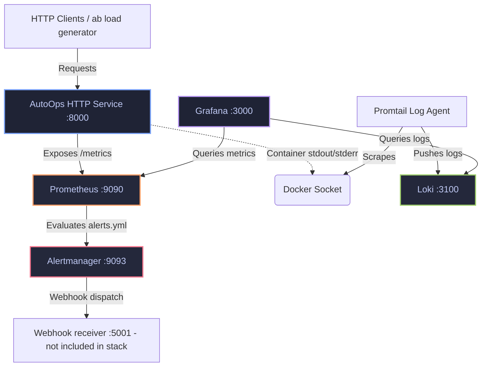

# AutoOps Architecture

AutoOps is a containerized SRE/observability learning project. It pairs a small instrumented Python HTTP service with a full monitoring stack (Prometheus, Grafana, Loki, Promtail, Alertmanager) running under Docker Compose, so metrics, logs, and alerts can be exercised end-to-end — including deliberately breaking things via a chaos endpoint.

---

## System Overview



---

## Components

| Service | Port | Image / Source | Role |
| :--- | :--- | :--- | :--- |
| **AutoOps** | `8000` | `./Dockerfile` (Python 3.12-slim) | Instrumented HTTP service under observation. |
| **Prometheus** | `9090` | `prom/prometheus:latest` | Scrapes metrics every 5s, evaluates alert rules. |
| **Grafana** | `3000` | `grafana/grafana:latest` | Dashboards querying Prometheus (metrics) and Loki (logs). |
| **Alertmanager** | `9093` | `prom/alertmanager:latest` | Groups, deduplicates, and routes firing alerts. |
| **Loki** | `3100` | `grafana/loki:2.9.0` | Log aggregation and storage backend. |
| **Promtail** | — (internal) | `grafana/promtail:2.9.0` | Tails `/var/run/docker.sock`, ships container logs to Loki. |

All services are wired together in a single Docker Compose network (`docker-compose.yml`). Volume mounts use `:Z` SELinux labels for Fedora/RHEL compatibility.

---

## Application (`agent/main.py`)

A minimal Python HTTP server — no framework, just `http.server` — instrumented with `prometheus_client`.

| Endpoint | Behavior |
| :--- | :--- |
| `GET /health` | Updates the `service_uptime_seconds` gauge, returns `200` with uptime. |
| `GET /metrics` | Serves metrics in Prometheus text format. |
| `GET /test` | Always returns `200` — used for load generation. |
| `GET /chaos` | Always returns `500` and increments the error counter — used to trigger alerts. |
| anything else | Returns `404`, increments the error counter. |

**Metrics exposed:**
- `http_requests_total{method,endpoint,status}` — counter
- `http_errors_total` — counter
- `http_request_duration_seconds` — histogram, 8 buckets from 10ms to 2s
- `service_uptime_seconds` — gauge

Every request is logged as `%(asctime)s | %(levelname)s | %(message)s`, including client IP, route, status, and latency. The process handles `SIGTERM`/`SIGINT` for graceful shutdown.

---

## Alert Rules (`monitoring/alerts.yml`)

**Operational alerts:**
- `HighErrorRate` (critical) — 5xx rate > 30% over 1m, for 30s.
- `AutoOpsDown` (critical) — Prometheus can't scrape the service, for 30s.
- `CrashLoopDetection` (critical) — process restarts more than twice in 1m, for 30s.

**SLO burn-rate alerts** (Google SRE-style, 99.5% error-budget target):
- `AutoHighErrorRateFastBurn` (critical) — error rate > 7% over 5m, for 2m (~14x burn).
- `AutoOpsHighErrorRateSlowBurn` (warning) — error rate > 1.5% over 1h, for 10m (~3x burn).
- `AutoOpsHighLatencyP95` (warning) — p95 latency > 200ms over 5m, for 5m.
- `AutoOpsHighLatencyP99` (warning) — p99 latency > 300ms over 5m, for 2m.

Alertmanager routes all firing alerts to a webhook receiver at `http://localhost:5001/` (see `monitoring/alertmanager/alertmanager.yml`) — that receiver is not part of the Compose stack and must be run separately if you want to see deliveries.

---

## Log Pipeline

1. AutoOps writes structured logs to stdout.
2. Promtail (mounted read-only against the Docker socket) discovers containers and tails their output.
3. Promtail relabels each stream with the container name and pushes it to Loki (`http://loki:3100/loki/api/v1/push`).
4. Grafana queries Loki via LogQL, e.g. `{container="autoops"}`.

---

## Grafana Dashboards

`dashboards/autoops-dashboard.json` tracks request rate (RPS), error rate, p95/p99 latency, service uptime, and alert status.

---

## Testing & Validation

**Load generation:**
```bash
ab -n 5000 -c 50 http://localhost:8000/test
```

**Chaos / alert testing:**
```bash
curl http://localhost:8000/chaos
```

**CI (`.github/workflows/ci.yml`)** runs on every push/PR:
- `flake8` lint on `agent/`
- `promtool check config` on `prometheus.yml`
- `promtool check rules` on `alerts.yml`
- Docker image build
- Full Compose stack boot + `/health` check + teardown

---

## Planned Next Steps

- OpenTelemetry tracing
- Kubernetes deployment
- Slack/email alert notifications
- Automated chaos testing workflows
