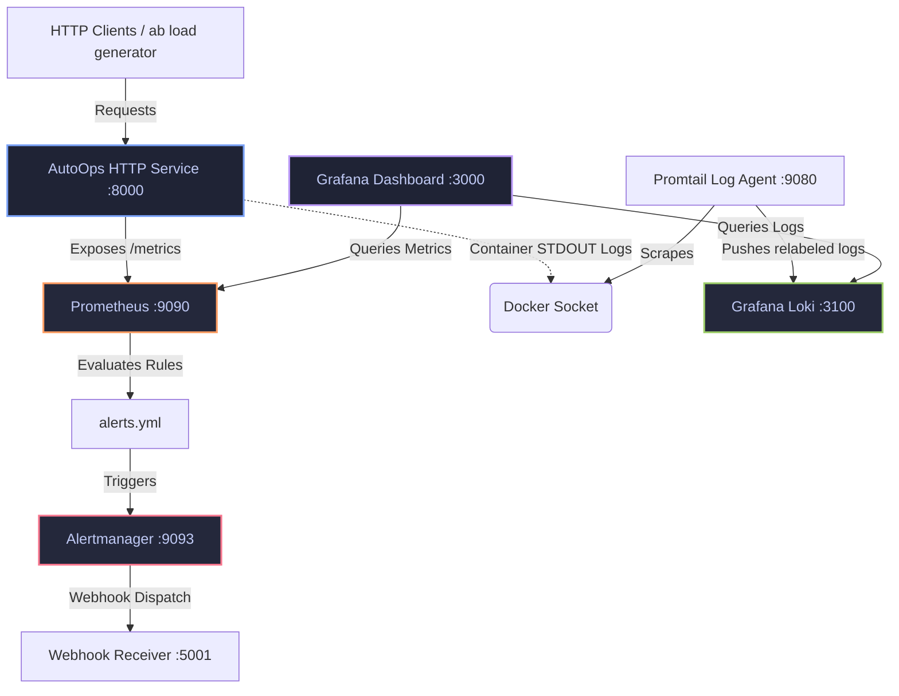

# AutoOps Project Context

AutoOps is a containerized, production-grade SRE (Site Reliability Engineering) and observability demonstration platform. Its core purpose is to model modern production monitoring, log aggregation, and alert engineering workflows using the industry-standard **Prometheus, Grafana, Loki, Promtail, and Alertmanager** stack.

This document serves as the central context and design manual for the AutoOps project.

---

## 🗺️ Architectural Overview

AutoOps represents a closed-loop monitoring pipeline. The instrumented Python web application serves traffic, generates telemetry data (metrics and logs), which are then ingested, aggregated, visualized, and evaluated against Service Level Objectives (SLOs) to trigger alerts when system health degrades.



---

## 🛠️ Tech Stack & Service Topology

The complete infrastructure runs within a single Docker virtual network, defined in [docker-compose.yml](file:///home/shreyansh/projects/AutoOps/docker-compose.yml).

| Container / Service | Port Mapping | Image / Source | Role |
| :--- | :--- | :--- | :--- |
| **AutoOps Application** | `8000:8000` | `./Dockerfile` (Python 3.12-slim) | Custom instrumented Python HTTP service. |
| **Prometheus** | `9090:9090` | `prom/prometheus:latest` | Metrics scraper, time-series storage, alert evaluator. |
| **Grafana** | `3000:3000` | `grafana/grafana:latest` | Unified dashboards for querying Prometheus and Loki. |
| **Alertmanager** | `9093:9093` | `prom/alertmanager:latest` | Alert router, deduplicator, and group agent. |
| **Loki** | `3100:3100` | `grafana/loki:2.9.0` | High-performance, log-aggregation database. |
| **Promtail** | *Internal* | `grafana/promtail:2.9.0` | Log collector tailing `/var/run/docker.sock`. |

---

## 🐍 Application Instrumentation (`agent/main.py`)

The application layer, written in native Python using `http.server` and instrumented via `prometheus_client`, exposes specific endpoints and gathers custom operational telemetry.

### Endpoints Matrix
- **`GET /health`**: Evaluates service operational state, sets the `service_uptime_seconds` gauge, and returns a `200 OK` response with uptime info.
- **`GET /metrics`**: Serves formatted time-series metrics scraped by Prometheus.
- **`GET /test`**: Standard simulated route for traffic generation.
- **`GET /chaos`**: A dedicated diagnostic endpoint designed to induce operational failures (increments error counters and returns a `500 Internal Server Error`). Used to validate alerts and SLO violations.
- **`Wildcard 404`**: Standard fallback endpoint recording unmapped route errors.

### Telemetry Instrumentation Details

```python
# ---------------- Prometheus Metrics Definitions ----------------
REQUESTS_TOTAL = Counter(
    "http_requests_total",
    "Total HTTP requests",
    ["method", "endpoint", "status"]
)

ERRORS_TOTAL = Counter(
    "http_errors_total",
    "Total HTTP errors"
)

REQUEST_LATENCY = Histogram(
    "http_request_duration_seconds",
    "HTTP request latency",
    buckets=[0.01, 0.05, 0.1, 0.2, 0.3, 0.5, 1, 2]
)

SERVICE_UPTIME = Gauge(
    "service_uptime_seconds",
    "Service uptime in seconds"
)
```

> [!NOTE]
> Application logging is fully structured and standard-formatted:
> `%(asctime)s | %(levelname)s | %(message)s`
> Every processed HTTP request is logged along with its status code, source IP, requested route, and response latency in milliseconds.

---

## 📈 Alert Rules & SLO (Service Level Objective) Engineering

Alerts are defined within [monitoring/alerts.yml](file:///home/shreyansh/projects/AutoOps/monitoring/alerts.yml) and categorized into basic operational failures and advanced multi-window, multi-burn-rate Service Level Objective (SLO) alerts.

### 1. Core System Health Alerts
*   **`HighErrorRate`** (Critical): Triggered when request error rates exceed **30%** over a 1-minute window.
    *   *Expression*: `sum(rate(http_requests_total{status=~"5.."}[1m])) / sum(rate(http_requests_total[1m])) > 0.3` (Duration: 30s)
*   **`AutoOpsDown`** (Critical): Fired if the service is unreachable by Prometheus.
    *   *Expression*: `up{job="autoops"} == 0` (Duration: 30s)
*   **`CrashLoopDetection`** (Critical): Fired if the application restarts more than twice within one minute.
    *   *Expression*: `changes(process_start_time_seconds{job="autoops"}[1m]) > 2` (Duration: 30s)

### 2. SLO & Burn-Rate Alerts
SRE workflows utilize *Error Budgets* (99.5% reliability target). A budget burn rate specifies how fast the service is consuming its allowed error margin.
*   **`AutoHighErrorRateFastBurn`** (Critical): Triggered when the service experiences a severe incident consuming the error budget 14x faster than normal (**>7% error rate**).
    *   *Expression*: `sum(rate(http_requests_total{status=~"5.."}[5m])) / sum(rate(http_requests_total[5m])) > (0.005 * 14)` (Duration: 2m)
*   **`AutoOpsHighErrorRateSlowBurn`** (Warning): Fired for sustained low-level regressions consuming the error budget 3x faster than normal (**>1.5% error rate**).
    *   *Expression*: `sum(rate(http_requests_total{status=~"5.."}[1h])) / sum(rate(http_requests_total[1h])) > (0.005 * 3)` (Duration: 10m)

### 3. Latency SLO Alerts
Ensures responsiveness constraints are strictly enforced:
*   **`AutoOpsHighLatencyP95`** (Warning): Fired if the 95th percentile request latency exceeds **200ms** over a 5-minute sliding window.
*   **`AutoOpsHighLatencyP99`** (Warning): Fired if the 99th percentile request latency exceeds **300ms** over a 2-minute sliding window.

---

## 🪵 Log Ingestion Pipeline (`Promtail` -> `Loki`)

Application containers stream structured logs to `stdout`. Rather than making the application ship logs directly, AutoOps implements a decoupled agent-based pattern:

1.  **Mounting Docker Socket**: `promtail` is granted read-only access to `/var/run/docker.sock`.
2.  **Container Discovery**: Promtail scans active Docker containers and collects their stdout/stderr streams.
3.  **Label Mapping & Relabeling**: Promtail parses container metadata, extracts the Docker container name, removes the leading slash, and applies it as a clean indexed label (`container="<name>"`).
4.  **Log Shipping**: Promtail pushes chunked log streams to Loki's API endpoint (`http://loki:3100/loki/api/v1/push`).

> [!TIP]
> In Grafana, developers can seamlessly query service logs alongside metrics using the LogQL expression:
> `{container="autoops"}`

---

## 🔄 Observability Testing and Validation Workflows

AutoOps incorporates active methods to stress the system and validate the full alerting lifecycle:

### Load Simulation
Generate a sustained pipeline of requests to observe standard traffic and latency percentiles in Grafana:
```bash
ab -n 5000 -c 50 http://localhost:8000/test
```

### Chaos Engineering & Alert Testing
Force severe SLO budget burn and trigger Prometheus page alerts instantly:
```bash
curl http://localhost:8000/chaos
```

### CI/CD Validation Pipeline
The repository uses GitHub Actions (`.github/workflows/ci.yml`) to guarantee config health on every commit:
- **Linting**: Python agent formatting checked via `flake8`.
- **Config Checking**: Promtool syntax verification on `prometheus.yml`.
- **Alert Testing**: Promtool rule checks against `alerts.yml` expressions.
- **Integration Test**: Boots up the entire docker compose topology, waits for the health check endpoint to return `200 OK` within 30 seconds, and gracefully tears down.
